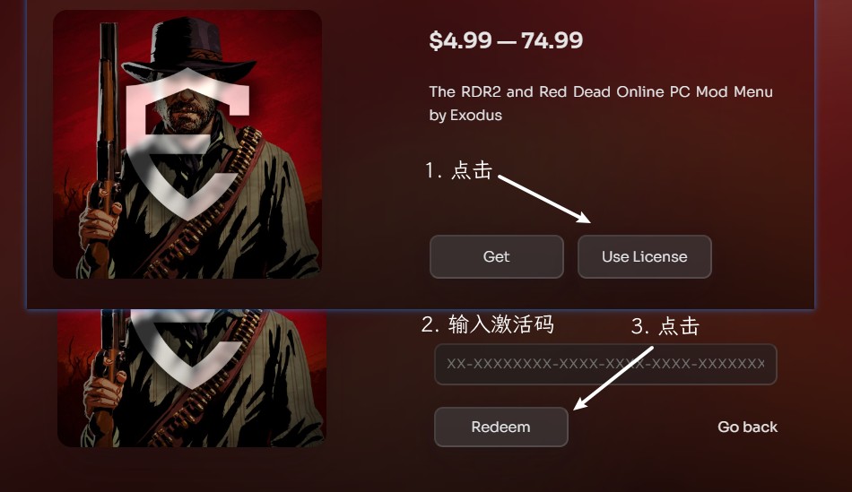

# Evodus教程

### 注册 

访问链接 https://exodusmenu.com/account/sign-up ，如下图所示注册


严禁输入任何中文及中文字符，因为字符导致的激活/注入失败本店一概不予解决 (其他菜单也是同理)


.png>)、

### 激活 

注册成功后，访问链接 https://exodusmenu.com/store/red-dead-online/rdr-online-mod-menu/view，如下图所示激活 (激活完毕会跳到新界面，代表激活成功)

<figure><figcaption></figcaption></figure>

### 安装与注入 

下载并打开本店制作的启动器 https://xiaokgta.lanzout.com/Exodus ，如下图所示操作

.png>)


本菜单需要在游戏视频设置中选中 DirectX 12 且关闭 Vulkan 的情况下才可正常使用


### 使用

`F3` 呼出/隐藏菜单

`小键盘` 8/2/4/6 分别控制上下左右

`回车键` 确认/切换选项

`退格键` 取消/返回上一级

`F12` 设置快捷键
